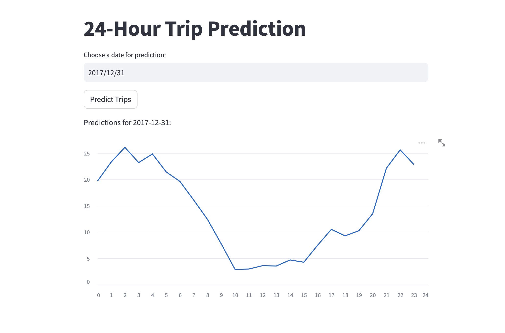

# BixiMatch

# Problem Statement

Solve the supply and demand curve. Here, supply is the number of bikes in a station and a number of users which is the demand for a given day or even hour. It is essentially a supply meets demand problem. The goal is to predict the number of bikes in a station for a given day or hour.

- Predict the number of trips per day
- Predict the number of bikes in a station for a given day or hour




# How to run the project

## Prerequisites

- Python 3.7 or higher
- Jupyter Notebook
- Streamlit
- FastAPI
- Docker

## Setup the Datasets

- Download the datasets from the below links and place them in the data folder

    BIXI - Movements history 2014 to 2017
        Total row: ~4018722 * 4
        Column: 6
        Features: start_date, start_station_code ,end_date , end_station_code, duration_sec, is_member
        Source: https://bixi.com/en/open-data/

    Historical Hourly Weather Data
        Total row: ~45253
        Column: 37
        Features: 30 US & Canadian Cities + 6 Israeli Cities
        Source: [https://www.kaggle.com/datasets/mahmoudima/mma-facial-expression](https://www.kaggle.com/datasets/selfishgene/historical-hourly-weather-data)

## Setup Virtual Environment

```bash
python3 -m venv venv
source venv/bin/activate
```

## Install Dependencies

```bash
pip install -r requirements.txt
```

## Execution Steps

```bash
streamlit run app.py
```

## Expected Output

- The streamlit app will be running on the localhost


# Target Feature

- Number of trips per day

# Data Collection & Preprocessing


## Dataset Summary
Here is a summary of the datasets used in the project:

    BIXI - Movements history 2014 to 2017
        Total row: ~4018722 * 4
        Column: 6
        Features: start_date, start_station_code ,end_date , end_station_code, duration_sec, is_member
        Source: https://bixi.com/en/open-data/

    Historical Hourly Weather Data
        Total row: ~45253
        Column: 37
        Features: 30 US & Canadian Cities + 6 Israeli Cities
        Source: [https://www.kaggle.com/datasets/mahmoudima/mma-facial-expression](https://www.kaggle.com/datasets/selfishgene/historical-hourly-weather-data)

## Training vs Test data distribution

 - 2014 to 2016 bike uses data is used for training and corresponding weather data
- 2017 bike uses data is used for testing and corresponding weather data

## Data Cleaning Process

### Type Conversion

 - Convert the start_date and end_date to datetime format

### Filter

  - Filter the data weather data for the only city of Montreal

### Merge

  - Merge the bike data with the weather data based on the start_date

### Imputing missing values

  - Impute the missing values in the weather data using the mean , meadian or mode of the column

### Droping rows

  - Drop the rows with missing values in the bike data

## Sample data

 See notebooks/data_exploration.ipynb

# Feature Engineering

## Feature Extraction

  - Extract the features from the date column like num_week, weekday, hour

## Feature Selection

  - Group by the data based on the num_week, weekday, hour
  - Calculate the number of trips per day based on the group
  - Drop the columns which are not required for the model

## Feature Transformation

  - Level encoding for the categorical column Description of the weather
  - Normalization of the train and test data using MinMaxScaler

# Model Selection & Training

## Model

  -  Ridge Regression

  $$
  E(w) = \frac{1}{2} \sum_{i=1}^{n} (y_i - w^T x_i)^2 + \frac{\lambda}{2} ||w||^2
  $$


## Training

  - Train the model using the training data
  - Predict the number of trips per day using the test data

## Model Evaluation

  - Calculate the MSE value for the model

  $
  MSE = \frac{1}{n} \sum_{i=1}^{n} (y_i - \hat{y_i})^2$

# Challenges faced in this project

- Parsing and Formatting the date :

  - Ensure that all date values are parsed into a consistent format. This might involve converting strings to datetime objects in Python using libraries like pandas or datetime. For instance
- Indexing
  - Set the date column as the index of the DataFrame. This allows for easier slicing and manipulation of the data based on time periods.
  ```
  df.set_index('date', inplace=True)
  ```
- Handling Missing Dates

- Feature Engineering from Dates

  - Extract useful features from the date values that may be relevant for the model, such as:
    - Day of the week
    - Month
    - Year
    - Hour of the day
    - etc.
- Normalization or Standardization
  
    - Normalize or standardize the numerical features in the dataset to ensure that they are on a similar scale. This can help improve the performance of machine learning models that rely on distance-based metrics or gradient-based optimization algorithms.
- Lag Features
  
    - Create lag features that capture the historical values of the target variable or other relevant features. This can help the model learn patterns and trends in the data that may be useful for making predictions.


# TODO

- [ ] This model now predicts the number of trips per day. The next step is to predict the number of bikes in a station for a given day or hour

- [ ] train the model so that its uses data until 2023 and test it on the data of 2024

- [ ] Gather the Montreal weather data until 2023

- [ ] Develop FastAPI for the model

- [ ] Automate the using docker


# Tech Stack

- Python
- Pandas
- Numpy
- Scikit-learn
- Matplotlib
- Jupyter Notebook
- Streamlit
- FastAPI
- Docker


